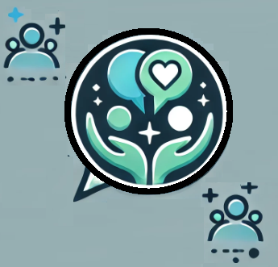
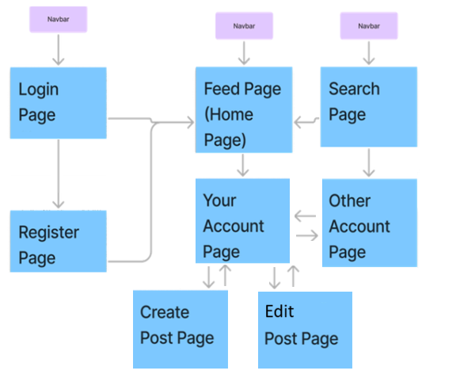
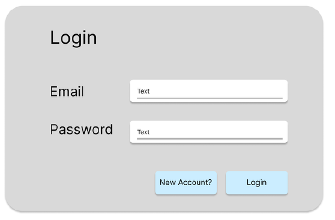
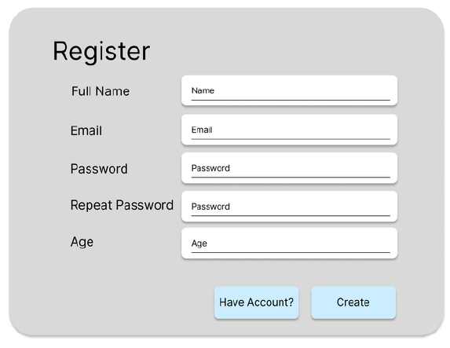
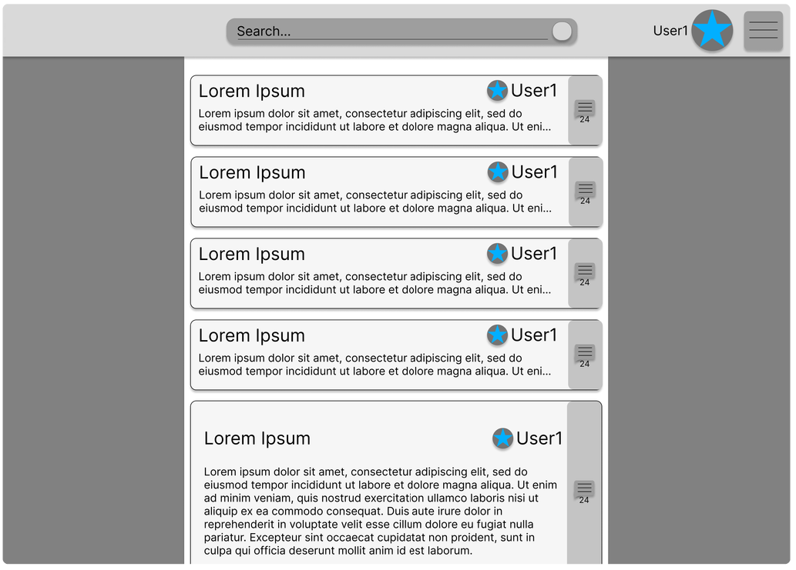
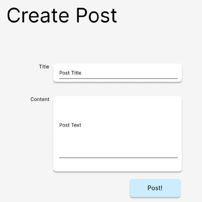
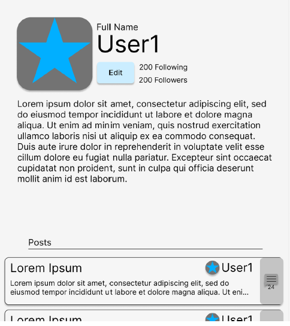
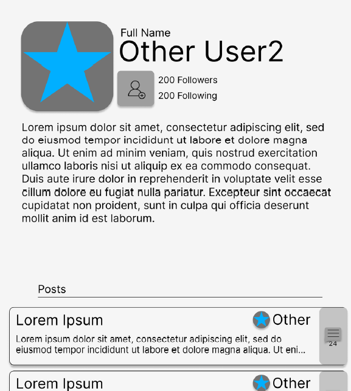

  
<h2 align="center">Activity 1</h2>
  

<h4 align="center">Kenia Madrazo</h4>
<h4 align="center">Grand Canyon University</h4>
<h4 align="center">CET</h4>
<h4 align="center">SDD-630</h4>                     
<h4 align="center">Professor Bobby Estey</h4>
                    
  

<h3>
Introduction</h3>

>
&emsp;&emsp;&emsp;Mental health challenges continue to rise, especially among individuals navigating high-stress environments, such as students, young professionals, and caregivers. Although social media platforms allow people to connect, they often contribute to anxiety, isolation, and self-comparison. The proposed solution is <strong>KenHealthPost</strong>, a social networking platform that blends mental health support, education, and community connection into a safe digital space. It provides a secure environment where users can share experiences, access resources, and engage with professionals or peers.

<h4>
Who is the ideal user?</h4>

 &emsp;&emsp;&emsp;The ideal user for KenHealthPost is a mental health-conscious individual, aged 18 to 35, who seeks both community support and mental wellness tools online. This user may be a student facing academic stress, a young adult transitioning into the workforce, or someone managing chronic stress or anxiety. The user values anonymity, empathy, and evidence-based content. They want a digital space free from toxicity, judgment, or misinformation something traditional social media platforms don’t offer. Additionally, KenHealthPost is designed for mental health professionals, such as counselors and therapists, who want to contribute educational content and provide group-level support without needing to offer formal therapy within the app.

**2. What problem exists for your ideal user?**

 
Despite the increased availability of mental health resources, many users feel disconnected or overwhelmed by conventional social media platforms that emphasize highlight reels and influencer culture. These platforms often lack contextual support, promote unrealistic lifestyles, and ignore the emotional needs of users(Fardouly et al., 2018). In contrast, professional therapy can be expensive, time-consuming, and intimidating for first-time seekers(Gulliver et al., 2010).

Users struggle with:

- Stigma around discussing mental health publicly(Corrigan & Watson, 2002).

- Lack of community support tailored to specific mental health topics.

- Inaccessibility of real-time, informal help or relatable conversations.

- Information overload with no filter on accuracy or source credibility (Naslund et al., 2016).

**3. What does the product you propose do to solve the problem?**

 
KenHealthPost offers a tailored, empathetic solution through a mental-health-focused social networking experience that includes:

 

➤ <strong>Role-Based Accounts:</strong> Users choose to sign up as a patients or Professional. Each role has specific tools. For example, therapists can have access to patients records and AI recommendations to provide the best possible feeback and support.

➤ <strong>Topic-Based Forums:</strong> Mental Health Patients can interact with Professionals and fellow patients via chats and videocalls.

➤ <strong>Wellness Feed:</strong> Unlike other platforms that use algorithms based on popularity, KenHealthPost curates a personalized feed of uplifting stories, educational content, and user reflections, based on selected interests and moods.

➤ <strong>Guided Self-Care Tools:</strong> Includes built-in journaling, and recommended exercises like grounding techniques or reflection prompts (Morledge et al., 2013).

➤ <strong>Peer and Expert Engagement:</strong> Users can interact with trained peer mentors or verified professionals through posts, live Q&As, or messaging (with privacy settings enabled)(Rice et al., 2014).

➤ <strong>Privacy-Centered Design:</strong> Users control visibility, post anonymously, and report harmful content instantly. There are no ads or influencer content.

By centering the platform around safety, empathy, and relevance, KenHealthPost fosters real connection without compromising mental health.

**4. What does the product look like?**

 
KenHealthPost adopts a minimalistic and calming design, avoiding overstimulating graphics or loud notifications. It uses soft tones blues, lavenders, and light greens and intuitive layouts. Particularly, KenHealthPost logo reflects the intention and commitment to support every individual's journey toward mental wellness with empathy, connection, and strength a symbol of hope, healing, and community empowerment.

 

**Figure 1:** KenHealthPost logo.

KenHealthPost features a navigation bar that connects to key pages such as Home, Login, Register, Search, Account, Create Post, and Other Accounts. The roles and responsibilities of these pages are outlined below. 

-Home page: displays posts from followed accounts.
   
-Registration page: allows account creation.
  
-User Account page: manages profiles and posts.

-Login page: prompts for retries or registration.

-Create Post page: supports text, photo, or Slat sharing.         

-Search page: helps find posts and profiles. 

The next SiteMap shows the pages of KenHealthPost platform. 

**Figure 2:** SiteMap of the platform.

**Figure 3:** Search bar of the platform.

**Figure 4:** Login Page.

**Figure 5:** Registration Page.

**Figure 6:** Home Page.

**Figure 7:** Create Post Page.

**Figure 8:** User Profile Page.

**Figure 8:** Other User Profile Page.

**5. What similar competing applications already exist?**

  Several platforms support mental health through digital tools, but most are either therapy-oriented or generic wellness apps:

➤ <strong>7 Cups:</strong> Offers chat-based support from volunteers and therapists.

➤ <strong>Reddit (r/mentalhealth):</strong>Popular for peer sharing, but lacks moderation and safety features.

➤ <strong>BetterHelp / Talkspace:</strong>Connect users to licensed therapists, but are subscription-based and not designed for social interaction.

➤ <strong>Calm / Headspace:</strong>Focus on mindfulness and meditation but do not support interactive communication or role-based networking.

No existing platform blends community building, structured support, and role-based engagement the way KenHealthPost does.

**6. What makes your idea different from existing solutions?**

  KenHealthPost is distinct in several key ways:

➤ <strong>Mental Health-first Social Network: </strong>Rather than adding mental health features to an existing network, KenHealthPost is purpose-built for mental wellness, from the UI to the user roles.

➤ <strong>Role-Based Access:</strong> Users see content relevant to their role.Patients might see peer discussions and Posts, while professionals manage patients records and answer questions.

➤ <strong>Community Without Comparison:</strong> There’s no “like” count or follower system. Feedback focuses on empathy-based reactions, not popularity.

➤ <strong>Anonymity with Accountability:</strong> Users can remain anonymous while still maintaining verified identities privately, helping reduce stigma without promoting toxicity.

➤ <strong>-Built-in Educational Components:</strong>Therapists and mental health professionals contribute curated content, such as coping strategies and myth-busting posts.

➤ <strong>-No Ads or External Noise:</strong>Unlike platforms monetized by attention, KenHealthPost ensures user safety and focus by avoiding ad-based algorithms.

## Conclusion

KenHealthPost reimagines how social platforms can foster connection in mental wellness spaces. With its blend of educational content, peer support, role-based tools, and privacy-first design, it fills a major gap between social networking and mental health support. While therapy apps are essential, not every user is ready for formal counseling. KenHealthPost offers an inclusive, gentle, and proactive alternative that promotes healing through community and reflection.

As mental health becomes a shared public concern, tools like KenHealthPost will become essential not only for individual support but also for cultural change. By normalizing mental wellness conversations and empowering users to connect with purpose, this platform lays the foundation for a healthier digital future.

## References
1. Corrigan, P. W., & Watson, A. C. (2002). Understanding the impact of stigma on people with mental illness. World Psychiatry, 1(1), 16–20.

2. Gulliver, A., Griffiths, K. M., & Christensen, H. (2010). Perceived barriers and facilitators to mental health help-seeking in young people: A systematic review. BMC Psychiatry, 10, Article 113. https://doi.org/10.1186/1471-244X-10-113

3. Morledge, T. J., Allexandre, D., Fox, E., Fu, A. Z., Higashi, M. K., Kruzikas, D. T., & Reese, P. R. (2013). Feasibility of an online mindfulness program for stress management. Journal of Occupational and Environmental Medicine, 55(4), 398–404.

4. Naslund, J. A., Aschbrenner, K. A., Marsch, L. A., & Bartels, S. J. (2016). The future of mental health care: Peer-to-peer support and social media. Epidemiology and Psychiatric Sciences, 25(2), 113–122.

5. Rice, S. M., Goodall, J., Hetrick, S. E., Parker, A. G., Gilbertson, T., Amminger, G. P., & Alvarez-Jimenez, M. (2014). Online and social networking interventions for the treatment of depression in young people: A systematic review. Journal of Medical Internet Research, 16(9), e206.

