  
<h2 align="center">SDD-630 Benchmark-Activity 2.1 Part 2</h2>
  

<h4 align="center">Kenia Madrazo</h4>
<h4 align="center">Grand Canyon University</h4>
<h4 align="center">CET</h4>
<h4 align="center">SDD-630</h4>                     
<h4 align="center">Professor Bobby Estey</h4>
                    
  

<h3>
Introduction</h3>

&emsp;&emsp;This report includes a link to the demo video showcasing the core functionality of the Minimum Viable Product (MVP). Additionally, screenshots of all the pages within the platform are provided to give a comprehensive view of the user interface and features.  

<h3>
Demo of the Prototype</h3>

&emsp;&emsp;The link to the video demonstrating the prototype is provided below. The primary goal of this demonstration is to showcase the design, layout, and overall navigability of the platform.

&emsp;&emsp;&emsp;[Link to Video](https://drive.google.com/file/d/1YSG74e71P1FFP2BSYIuYR8EPNHBkhcaR/view?usp=sharing)

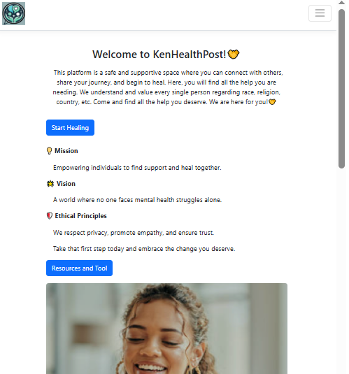

Figure 1: Home Page part 1.

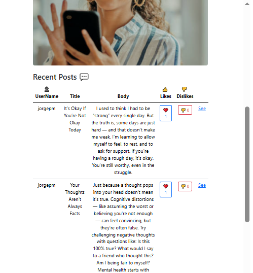

Figure 2: Home Page part 2.

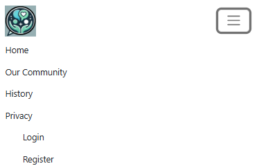

Figure 3: Menu.

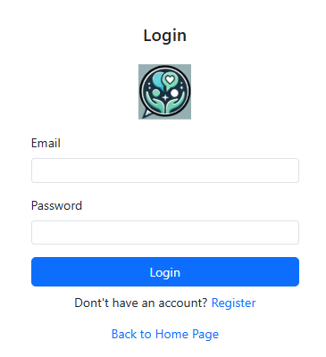

Figure 4: Login.

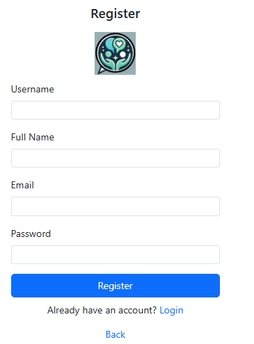

Figure 5: Register.

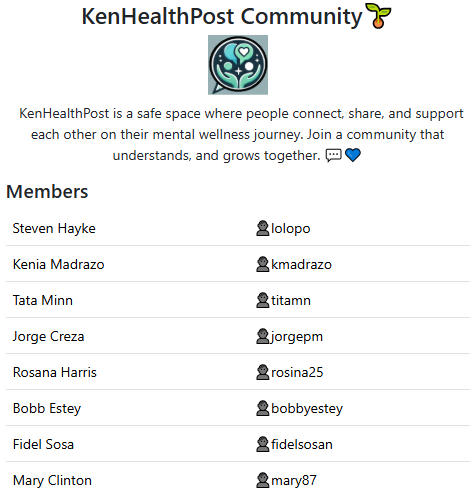

Figure 6: Our Community page.

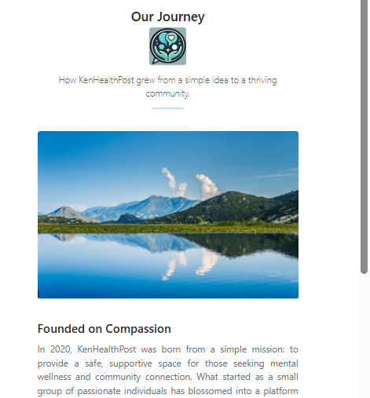

Figure 7: History page.

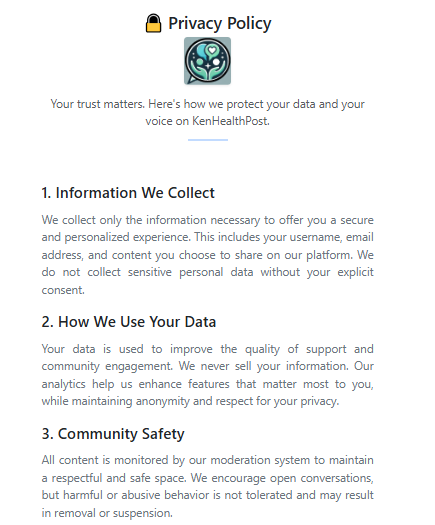

Figure 8: Privacy page.

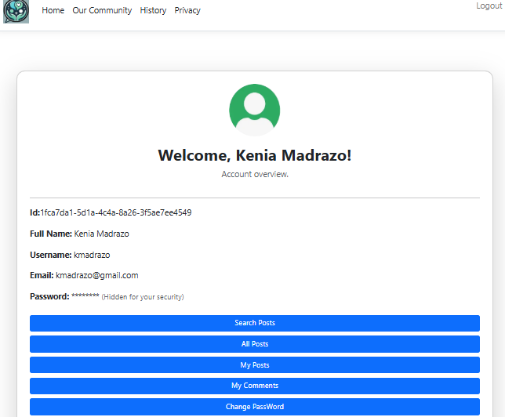

Figure 9: MyAccount page.

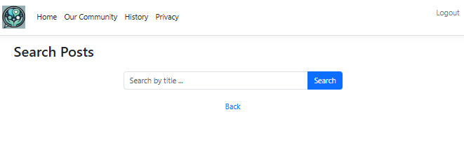

Figure 10: Search page.

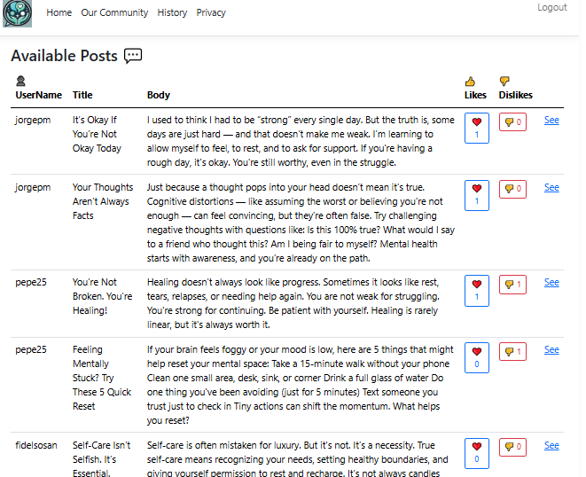

Figure 11: Available Posts page.

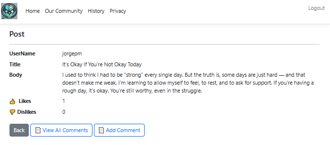

Figure 12: Post Details page.

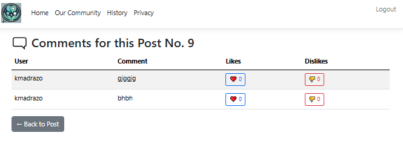

Figure 13: Comments for this Post page.

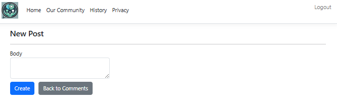

Figure 14: Add Commento to Post page.

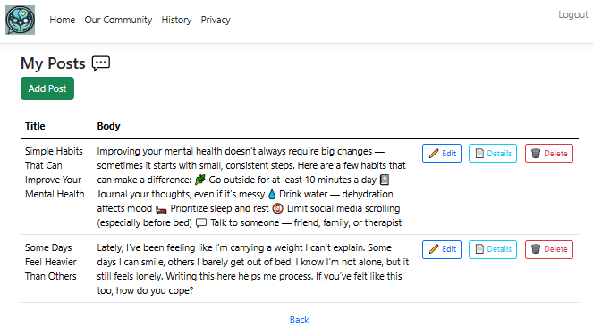

Figure 15: MyPosts page.

Figure 16: MyComments page.

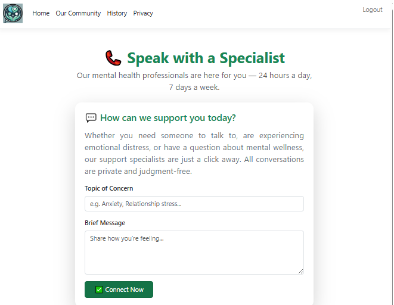

Figure 17: SpeakToSpecialist page.

## Conclusion

&emsp;&emsp;The design phase of this project focused on identifying and organizing user stories into three categories: <strong>Essential Features (MVP)</strong>, <strong>Nice to Have</strong>, and <strong>Future Plans</strong>. Priority was given to the MVP features to ensure that the core functionality was delivered first. These essential features such as account creation, post management, and user interaction—were successfully demonstrated in the video, which showcased the WPA prototype working as intended.
 
&emsp;&emsp;The remaining "Nice to Have" and "Future Plans" features will be addressed in upcoming development cycles. By following the Scrum framework, the project will continue to evolve based on ongoing feedback and emerging requirements. This iterative, user-focused approach ensures that the platform remains adaptable, scalable, and prepared for long-term growth.
