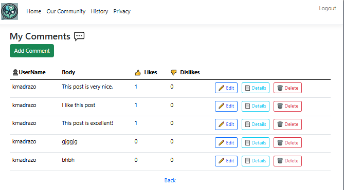

  
<h2 align="center">SDD-630 Benchmark-Activity 2.1</h2>
  

<h4 align="center">Kenia Madrazo</h4>
<h4 align="center">Grand Canyon University</h4>
<h4 align="center">CET</h4>
<h4 align="center">SDD-630</h4>                     
<h4 align="center">Professor Bobby Estey</h4>
                    
  

<h3>
Introduction</h3>

&emsp;&emsp;This reports include the link to the demo video to demostrate the essential MVP. Also screenshots of the all pages of the platform were included.  

<h3>
Demo of the Prototype</h3>

&emsp;&emsp;The link to the video demonstrating the prototype is included below. The main goal was to demostrate design and navegability.

https://gitlab.com/bobby.estey/wikibob/-/blob/master/README.md

Figure 1: Home Page part 1.

Figure 2: Home Page part 2.

Figure 3: Menu.

Figure 4: Login.

Figure 5: Register.

Figure 6: Our Community page.

Figure 7: History page.

Figure 8: Privacy page.

Figure 9: MyAccount page.

Figure 10: Search page.

Figure 11: Available Posts page.

Figure 12: Post Details page.

Figure 13: Comments for this Post page.

Figure 14: Add Commento to Post page.

Figure 15: MyPosts page.

Figure 16: MyComments page.

Figure 17: SpeakToSpecialist page.
